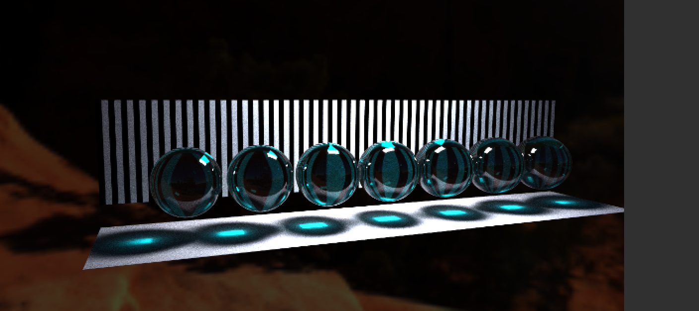

# POiGK lab2
### Wygląd sceny - efekty
Chrom

Złoto

Perłowy

Szkło

Niebiesko-fioletowy

### Dodane slidery
Dodano Albedo, RefractionColor, RefractionChance, RefracionRoughness, SpecularColor, SpecularChance, SpecularRoughness

